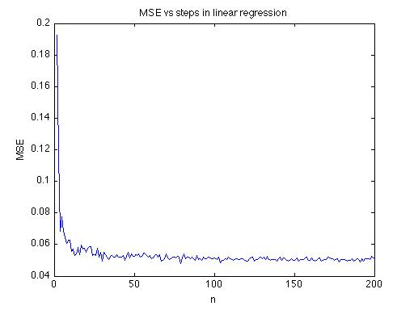
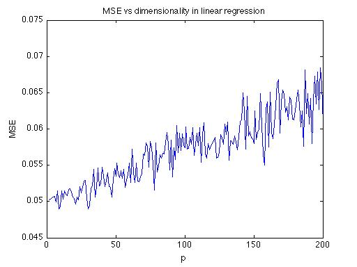
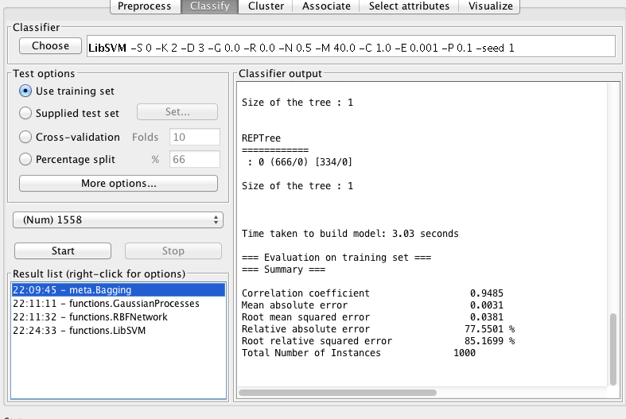
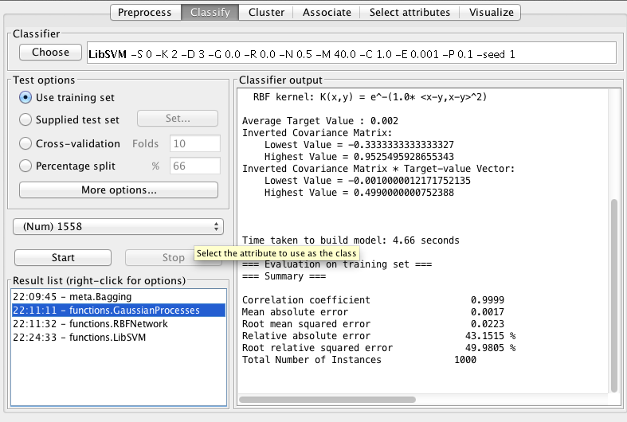
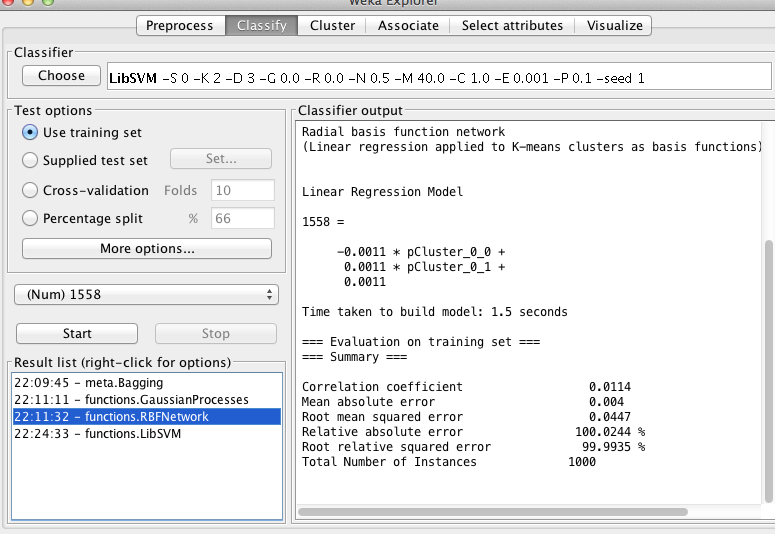
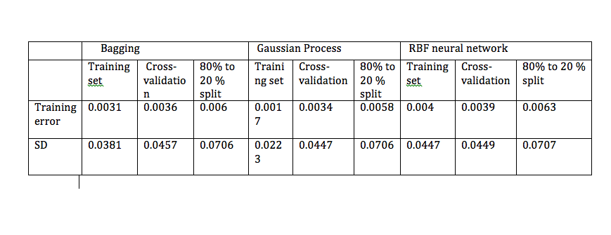

#EECS 738 lab 2 by Zaikun Xu

## Part I
### experiments

First, fix c = 0.1, p = 2, vary n from 10 to 1000 and calculate the MSE 

Second, fix n = 10，p = 2, vary c = 0.01 to 1 and calcualte MSE

Third, fix n = 1000 > p, c= 0.1, vary p from 2 to 1000, calculate MSE

### source code

function [m, b] = meanse(n,c, p)

x = 0;

for i= 1:30

x1 = rand(n,p-1)';

x2 = ones(1,n);

X = [x1;x2]' ;

beta = ones(p,1);

elson = rand(n,1);

Y = X * beta + c * elson;

beta_hat = inv(X'*X) * X' * Y ;

x = x +  sqrt(sum((beta - beta_hat).^2));

end

m = x/30;

b = beta_hat;

end

### result analysis

In table1, we can tell that as n increses, the MSE decreases dramatically initially and then after at about n = 20, decreases very slowly. this make sense, because as you have more data, the variance of points will be lower and thus our model can represent the ground truth better.

For table2, as c increases, the MSE increases linearly with c. This also makes sense that c contributes the variance term. as c increses, we have more noise, then the MSE will increase and should scale linearly with c.

For table3, as P increases, the MSE increases according, in a linear pattern. It also makes sense. As you incerase the dimensonality of data, the effect of curse of dimensionality will be more obvious

## Part II (weka)
### Introduction
#### dataset
The dataset is a 1001 by 1559 matrix, where each column is data point and each row is one feature. the data include two classes: advertisement image and non-advertisement image. Features include image url, anchor text, but there are lots of missing values.
##### model
I choose three models, the Bagging, GaussianProcess and the RBF neural netwrok.
The idea of Bagging is to sample your data set multiple times and then use these new dataset to predict. Afterwards, you combine these multiple predictions.

The idea of GaussianProcess is that given N data points, you can use a multivariate Guassian to represent the data and do classification.

The idea of RBF neural network is as follows:  the unknow function f(x) can be approximated by the weighted sum of neurons.
From the input layer to the hidden layer, you have a activition funciton , which is a radial basis function. By propagating and udate weights of each neurals, the trained outputs will approximated their real values.

### Experiments
For each model, use there different options, namesly, Using training set, cross-validation and percentage split to see how these choices influence the performance of each model.

### screen prints for each classifier

### results and analysis

####Compare between models
Gussian Process works slightly better than the other two models for both training error and standard derivation.
#####Compare between training choices
If choose traing set , the overall training error is the lowest.
80% split makes the training error worse. Cross-validation is in the middle.

