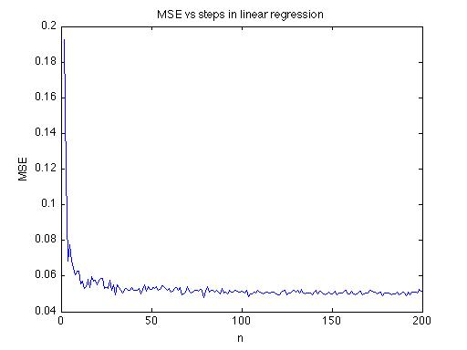
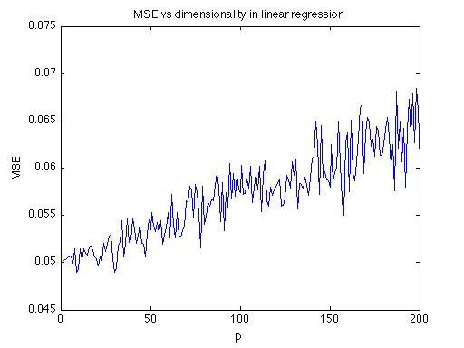
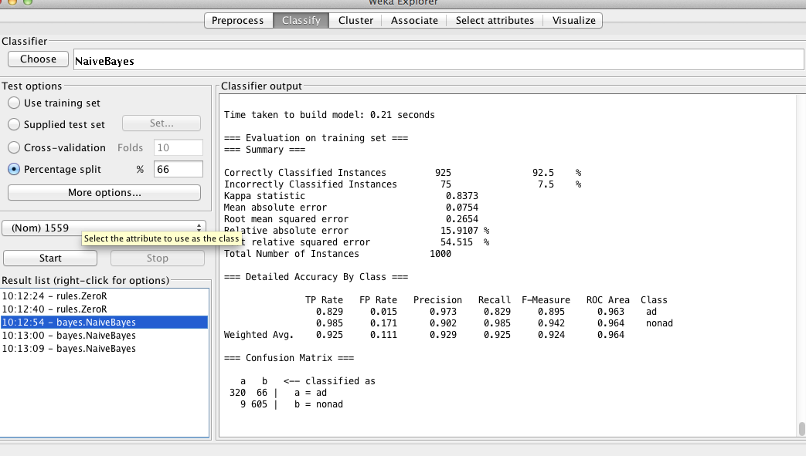
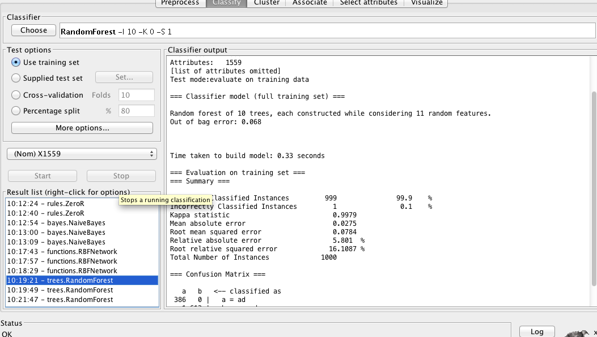
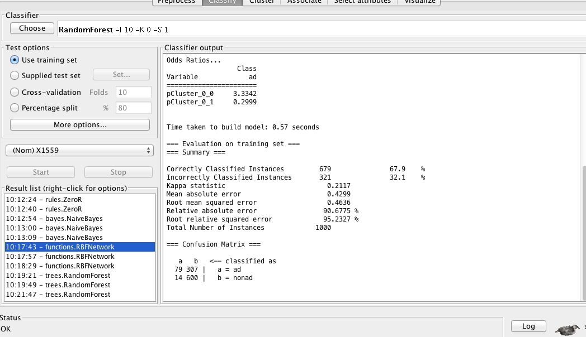
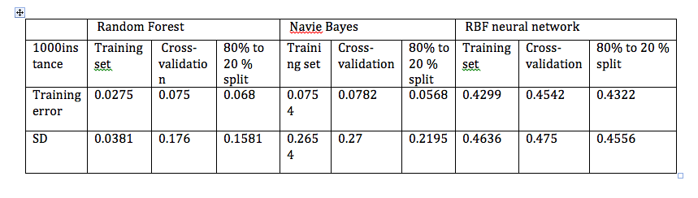

#EECS 738 lab 2   Zaikun Xu

# Part I
## experiments

First, fix c = 0.1, p = 2, vary n from 10 to 1000 and calculate the MSE 

Second, fix n = 10，p = 2, vary c = 0.01 to 1 and calcualte MSE

Third, fix n = 1000 > p, c= 0.1, vary p from 2 to 1000, calculate MSE

## source code

function [m, b] = meanse(n,c, p)

x = 0;

for i= 1:30

x1 = rand(n,p-1)';

x2 = ones(1,n);

X = [x1;x2]' ;

beta = ones(p,1);

elson = rand(n,1);

Y = X * beta + c * elson;

beta_hat = inv(X'*X) * X' * Y ;

x = x +  sqrt(sum((beta - beta_hat).^2));

end

m = x/30;

b = beta_hat;

end

## result analysis

In table1, we can tell that as n increses, the MSE decreases dramatically initially and then after at about n = 20, decreases very slowly. this make sense, because as you have more data, the variance of points will be lower and thus our model can represent the ground truth better.

For table2, as c increases, the MSE increases linearly with c. This also makes sense that c contributes the variance term. as c increses, we have more noise, then the MSE will increase and should scale linearly with c.

For table3, as P increases, the MSE increases according, in a linear pattern. It also makes sense. As you incerase the dimensonality of data, the effect of curse of dimensionality will be more obvious

# Part II (weka)
## Introduction
### dataset
The dataset is a 1001 by 1559 matrix, where each column is data point and each row is one feature. the data include two classes: advertisement image and non-advertisement image. Features include image url, anchor text, but there are lots of missing values.
#### model
I choose three models, the Random Forest, Navie Bayes and the RBF neural netwrok.

The idea of Random Forest is combine the idea of "bagging ", where you sample the data multiple times and the ideas of random selection of features. It works by combining many decision trees to improve the prediction accuracy.

The idea of Naive Bayes is based on the bayes rule and have the assumption (which might be wrong, but in reality it works well) that one feature is independent of another give a class variable. It is a probabilistic model.

The idea of RBF neural network is as follows:  the unknow function f(x) can be approximated by the weighted sum of neurons.
From the input layer to the hidden layer, you have a activition funciton , which is a radial basis function. By propagating and udate weights of each neurals, the trained outputs will approximated their real values.

## Experiments
For each model, use there different options, namesly, Using training set, cross-validation and percentage split to see how these choices influence the performance of each model.

## screen prints for each classifier

## results and analysis

##Compare) between models
The RBF works not good, the training erorr is around 0.4. Both the Navie Baye and Random Forest work better and Random Forest works best in both training error and standard derivation.

##Compare between training choices
In both the navie bayes and RBF,the 80% split works better with low training errors and low standard derivation. In the random forest case, the case is different, where you have low training error with the training data only.

