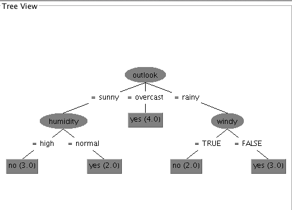

## EECS 738 machine learning lab 4
### Part I
####(1) The complete table for KStar classifier
classfier	 | Training error | Test error
:----------- | :-----------: | -----------:
Kstar(B = 20, M = a) Training dataset       | 0      | 0.3449
KStar (B = 100, M = a) Training dataset Tuned     | 0     | 0.3354
KStar (B = 20, M = a) Cross-validation    |  0.3439 | 0.3449
KStar (B = 40, M = d) Cross-validation Tuned | 0.3388 | 0.3385

####(2) The complete table for KStar classifier
classfier	 | Training error | Test error
:----------- | :-----------: | -----------:
AdaBoostM1 (P = 100, s = 1, l = 10, c = Desiciondump ) Training dataset       | 0.3433      | 0.3608
AdaBoostM1 (P = 100, s = 1, l = 40, c = RandomForest ) Training dataset Tuned  | 0.06     | 0.255
AdaBoostM1 (P = 100, s = 1, l = 10, c = Desiciondump) Cross-validation    |  0.3449 | 0.3608
AdaBoostM1 (P = 200, s = 2, l = 40, c = RandomForest )  Cross-validation Tuned | 0.1818 | 0.272

###part II

(1) the selected features are : outlook humidity and windy

(2)

(3)  my observation of the feature selection for weather is that outlook is the master feature and following by humidity and windy as sub feature.
Basically, the feature selection goal is to better represent the data, capture the majoi inner variant of data and avoid overfitting. For example, in PCA, we can use the first k princinple components as feature, which are the major variants of the data. The Decision uses information gain to choose features such that entroy is minimized.